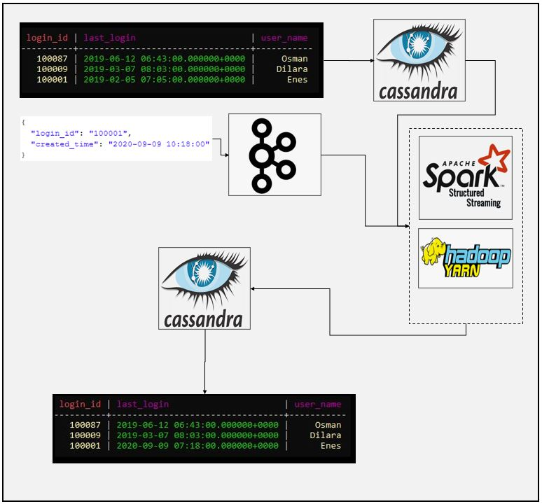
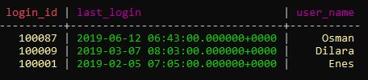
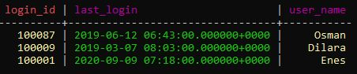

# SparkStream Static and Stream Data Join Example
### Dataflow Pipeline


### Summary

This is kafka source cassandra database sink example. In this spark application we are streaming login data of some users. At the same time we are reading historical data from cassandra database and join streaming data with static data to update cassandra table with new records. That way we are keep tracking last login time of each users using spark streaming application.

### Task List

- [x] Create cassandra keyspace and table
```
CREATE KEYSPACE spark_db WITH replication = {'class': 'SimpleStrategy', 'replication_factor': 1};
USE spark_db;
CREATE TABLE users(Login_id text PRIMARY KEY, user_name text, last_login timestamp);
```
- [x] Insert data to cassandra table
```
INSERT INTO users (Login_id, user_name, last_login) VALUES( '100001', 'Enes', '2019-02-05 10:05:00');
INSERT INTO users (Login_id, user_name, last_login) VALUES( '100009', 'Dilara', '2019-03-07 11:03:00');
INSERT INTO users (Login_id, user_name, last_login) VALUES( '100087', 'Osman', '2019-06-12 09:43:00');
```

- [x] Create kafka topic
```
/home/enes/Software/kafka_2.12-2.7.0/bin/kafka-topics.sh --create --zookeeper localhost:2181 --replication-factor 1 --partitions 1 --topic logins
```
- [x] Create spark session and define cassandra configuration (You can use ".master("local[*])" instead of yarn if you are running Spark on standalone mode")
```
# Create spark session
    spark = SparkSession \
        .builder \
        .appName("Stream Table Join") \
        .master("yarn") \
        .config("spark.streaming.stopGracefullyOnShutdown", "true") \
        .config("spark.sql.shuffle.partitions", 2) \
        .config("spark.cassandra.connection.host", "localhost") \
        .config("spark.cassandra.connection.port", "9042") \
        .getOrCreate()
```
- [x] Define schema for incoming data
```
# Define schema for incoming data
    login_schema = StructType([
        StructField("created_time", StringType()),
        StructField("login_id", StringType())
    ])
```
- [x] Read data from kafka source
```
# Read data from kafka topic
    kafka_source_df = spark.readStream \
        .format("kafka") \
        .option("kafka.bootstrap.servers", "localhost:9092") \
        .option("subscribe", "logins") \
        .option("startingOffsets", "earliest") \
        .load()
```
- [x] Apply deserialization
```
# Deserialization
    value_df = kafka_source_df.select(from_json(col("value").cast("string"), login_schema).alias("value"))
```
- [x] Convert time data to timestamp
```
# Convert "created_time" data to timestamp
    login_df = value_df.select("value.*") \
        .withColumn("created_time", to_timestamp(col("created_time"), "yyyy-MM-dd HH:mm:ss"))
```

- [x] Read existing data from cassandra database
```
#Read current cassandra table

    user_df = spark.read \
        .format("org.apache.spark.sql.cassandra") \
        .option("keyspace", "spark_db") \
        .option("table", "users") \
        .load()
```

- [x] Define join statements
```
# Define join statements
    join_expr = login_df.login_id == user_df.login_id
    join_type = "inner"
```

- [x] Join streaming data with static data from cassandra
```
# Join new data from kafka (streaming data) with existing data from cassandra (static data)
    joined_df = login_df.join(user_df, join_expr, join_type) \
        .drop(login_df.login_id)
```

- [x] Create output column for updated data
```
# Create output column to update last login record in cassandra db
    output_df = joined_df.select(col("login_id"), col("user_name"),
                                 col("created_time").alias("last_login"))
```

- [x] Define foreachBatch function to save updated data to cassandra
```
# Define foreachbatch function to save stream data to cassandra table
def write_to_cassandra(target_df, batch_id):
    target_df.write \
        .format("org.apache.spark.sql.cassandra") \
        .option("keyspace", "spark_db") \
        .option("table", "users") \
        .mode("append") \
        .save()
    target_df.show()

```

- [x] Finally write data into cassandra db
```
# Write joined data into cassandra table
    output_query = output_df.writeStream \
        .foreachBatch(write_to_cassandra) \
        .outputMode("update") \
        .option("checkpointLocation", "Cassandra/chk-point-dir") \
        .trigger(processingTime="1 minute") \
        .start()

    output_query.awaitTermination()
```

### Code Description

spark_kafka_cassandra_join.py file is spark application to read data from both kafka source and cassandra database, kafka data will be deserialized and joined with existing data and updated login information inserted into cassandra database. It is good example when you required to update or map some external informations without allocating memory to much. You can always use external database to store metadata.

### Running

1. Create kafka topics

2. Run kafka-console producer
```
/home/enes/Software/kafka_2.12-2.7.0/bin/kafka-console-producer.sh --broker-list localhost:9092 --topic logins
```

3. Create cassandra db and insert values

4. Check values from cassandra db



5. Enter sample data to kafka console producer
```json
{
  "login_id": "100001",
  "created_time": "2020-09-09 10:18:00"
}
```
6. Check cassandra table for result


